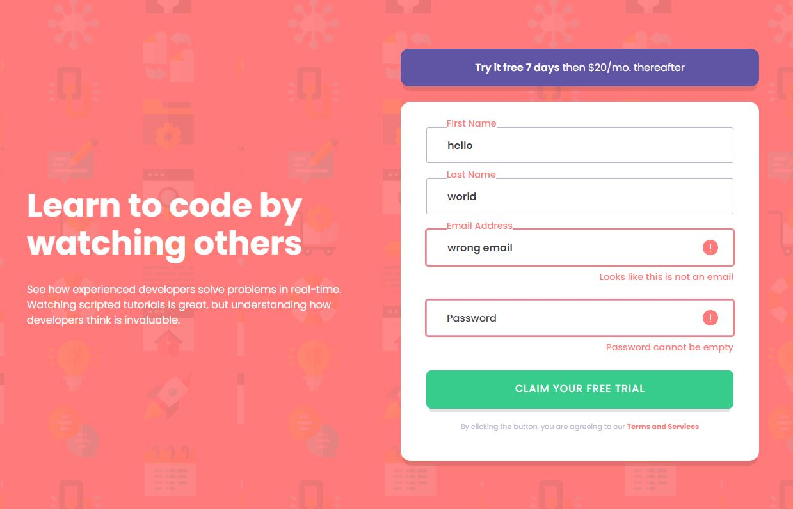
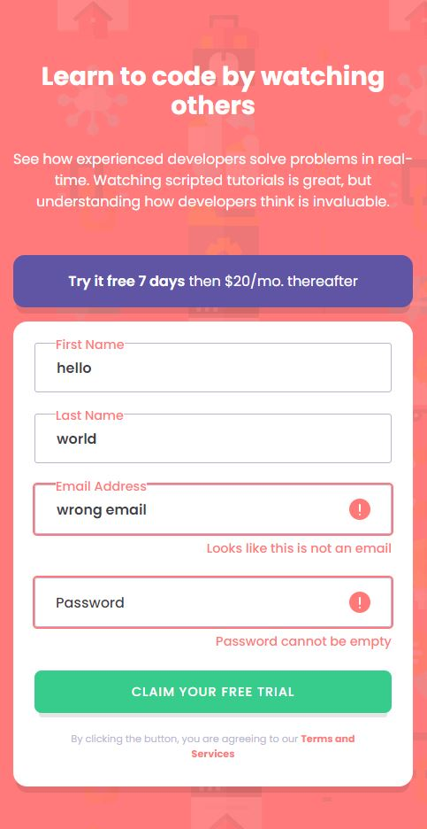

# Frontend Mentor - Order summary card solution

This is a solution to the [Order summary card challenge on Frontend Mentor](https://www.frontendmentor.io/challenges/order-summary-component-QlPmajDUj). Frontend Mentor challenges help you improve your coding skills by building realistic projects.

## Table of contents

- [Overview](#overview)
  - [The challenge](#the-challenge)
  - [Screenshot](#screenshot)
- [My process](#my-process)
  - [Built with](#built-with)
  - [What I learned](#what-i-learned)
  - [Continued development](#continued-development)
- [Author](#author)

**Note: Delete this note and update the table of contents based on what sections you keep.**

## Overview - [LIVE DEMO](https://yeongoh.github.io/intro-component-with-signup-form)

Putting labels inside the input field is a trend with material ui I think, but it adds a bit of complexity and reduces UX as labels are also what users can click to access the input field. I do not mind either way and it was first time trying this design.

Sign-up form is one of the first components that user sees when he visits the website for the first time. It is crucial to be visually appealing and good on user experience. To look back, I only made a couple of login forms since I started web development journey. I think just doing a separate component practice like this was good experience and it was not that easy and took me longer than I expected.

I ended up with a lot of repeating JavaScript codes, but I could not think of a better way at my level yet. I want to do more projects that involves JavaScript now.

### The challenge

Users should be able to:

- View the optimal layout for the site depending on their device's screen size
- See hover states for all interactive elements on the page
- Receive an error message when the `form` is submitted if:
  - Any `input` field is empty. The message for this error should say _"[Field Name] cannot be empty"_
  - The email address is not formatted correctly (i.e. a correct email address should have this structure: `name@host.tld`). The message for this error should say _"Looks like this is not an email"_

### Screenshot

## My process

The pure css part was not hard, but making sure label tag was inside the input, and fitting in
error icons and error message took me some time. I ended up using absolute positioning for labels and icons. Error message had to have some space so it can stretch out the card. Therefore static position was used.
It was my first time ever utilizing new FormData in Javascript and ended up with repetitive codes such as add class remove class. I assume there is a better way to handle it, but I could not think of it at my level yet.

### Built with

- Semantic HTML5 markup
- CSS custom properties
- Flexbox
- Javascript Dom manipualtion

### What I learned

I got more familiar with dom manipulations in this project.

### Continued development

I need to work on accessibility when errors pop up.

## Author

- Frontend Mentor - [@YeongOh](https://www.frontendmentor.io/profile/YeongOh)
